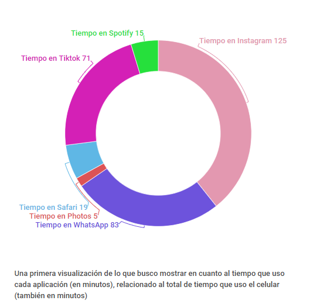

## VISUALIZACIÓN DE LA INFORMACIÓN
**TRABAJO PRÁCTICO NÚMERO 1: VISUALIZANDO DATOS PERSONALES**

##

**Título**

Uso del Celular

##

**Presentación del Tema**

El tema elegido y que voy a presentar en el día de la fecha consiste en poder mostrar cuánto uso el celular y cómo varía el uso en las diferentes aplicaciones, a lo largo de tres semanas.

##

**Datos**

###### La recolección de datos comenzó el Lunes 23 de Agosto del 2021 y finalizó el Domingo 12 de Septiembre de 2021.
Los datos crudos se encuentran en tres *archivos.csv*:
- El primero tiene toda la data recolectada: [DatosPersonales](DatosPersonales.csv)
- El segundo sólo tiene la cantidad de minutos que estuve en cada aplicación, por día: [TidyDataMinutes](TidyDataMinutes.csv)
- El tercero contiene la cantidad de Notificaciones y PickUps por día: [TidyDataCount](TidyDataCount.csv)

Los datos se obtuvieron a partir de una herramienta propia de un Iphone 11, llamada Screen Time. A partir de los datos brindados por dicha aplicación, yo extraje a mano aquellos que quería utilizar para el desarrollo del Trabajo Práctico, y los inserté de la siguiente manera:

- Día
- Tiempo Total: uso total del celular por día, tiempo en minutos
- Tiempo en las 6 aplicaciones más utilizadas (Instagram, WhatsApp, Spotify, TikTok, Safari, Photos): tiempo en minutos
- Cantidad de PickUps: veces que agarro el celular
- Cantidad de Notificaciones

##

**Puntos a analizar y mostrar**

Se quiere realizar un análisis de la cantidad de tiempo que utilizo el celular por día, pudiendo ver así cómo varía semana a semana. También, poder mostrar el tiempo que paso en las aplicaciones que más utilizo y cómo se relaciona el uso de las diferentes aplicaciones con el tiempo total de uso. 
A modo de ejemplo, el siguiente gráfico:

## 

**¿Cómo realicé la presentación?**

Para la presentación del trabajo utilicé Tableau, programa en el cual realicé: TreeMaps, Pie Charts, Bar Charts y Line Charts. 

Hice un dashboard con cada gráfico, y una vez que los terminé decidí ponerlos todos en un story. Entonces, subí dicho story a Tableau Public y de ahí embebí el código brindado.

Previo a embeber el código, yo ya había creado un archivo.html para poder visualizar dicho HTML una vez finalizado, insertando el nombre del mismo en el link que lleva mi nombre.github, seguido de dónde se encuentra dicho archivo. Mi link al HTML: *sofiaweintraub.github.io/pdata/visualizacion.html*

